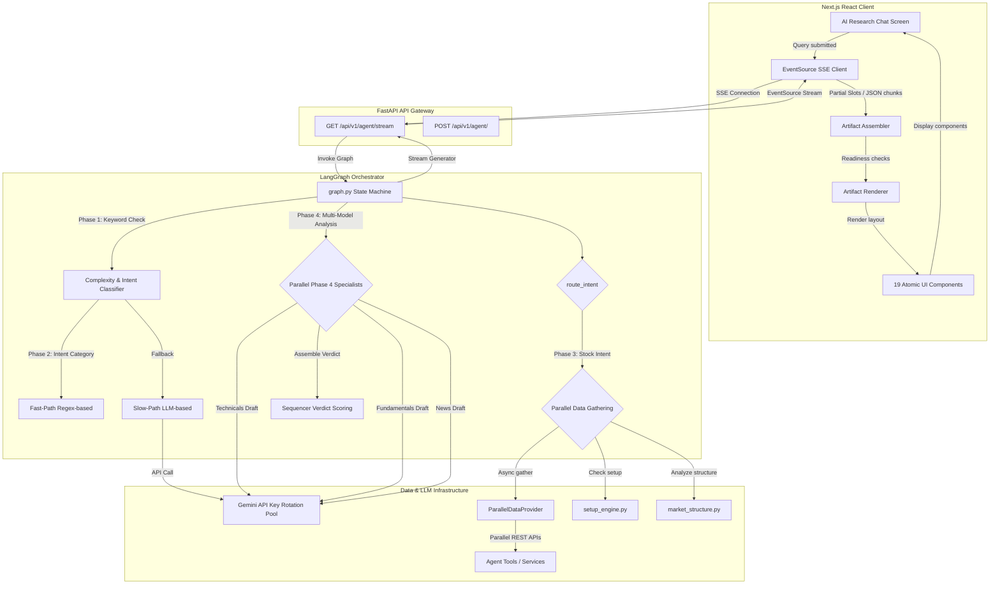

# FinSight AI — AI Analysis System Reference Document

This document provides a comprehensive, end-to-end architectural guide for the AI Research and Analysis system in FinSight AI. It details the execution flow from the moment a user submits a query on the Next.js frontend, through the FastAPI SSE streaming API, into the LangGraph state machine, down to the multi-model LLM provider pool, parallel data services, and finally back to the frontend's dynamic Artifact rendering engine.

---

## 1. Architectural System Overview

The AI Analysis system is a hybrid orchestrator. It uses a **FastAPI** backend to run a multi-agent state machine built on **LangGraph**, utilizing a custom rotation pool of **Google Gemini API keys** to distribute traffic, query external web services in parallel via a waterfall fallback provider layer, and stream real-time JSON and markdown chunks to a **Next.js** frontend. 

The frontend consumes this stream using Server-Sent Events (SSE) and progressively reconstructs a dynamic, rich UI dashboard (known as an **Artifact**) composed of individual **Atomic Components** that represent technical indicators, financial metrics, sentiment gauges, and trading plans.

### System Flow Diagram (Mermaid)



---

## 2. Backend Execution Flow (LangGraph Pipeline)

The core business logic of the AI system is contained in [graph.py](file:///d:/Full-Stack-Client-Dashboard/backend/app/agent/graph.py). It uses `langgraph` to construct a stateful workflow representing a financial analyst's research steps.

### Phase 1 — Rule-Based Complexity Classification
Before invoking any LLM, the system runs a fast keyword-matching routine to classify the query's complexity:
- **`classify_query_complexity(query)`** L266-278 checks the user's string against predefined lists:
  - **`SIMPLE_KEYWORDS`** (e.g., "price", "quote", "live"): Routes the query to lower-tier models and skips expensive extraction steps.
  - **`MEDIUM_KEYWORDS`** (e.g., "rsi", "indicator", "macd", "support", "resistance"): Categorizes as mid-tier complexity.
  - **`COMPLEX_KEYWORDS`** (e.g., "compare", "valuation", "ratio", "financials", "discounted cash flow"): Categorizes as high-tier.
- This phase helps allocate resources efficiently, optimizing API response times and conserving quota on premium model tiers.

### Phase 2 — Intent and Artifact Library Classification
The agent must identify *what* the user is asking about (Intent Category) and *how* to present the response (Artifact type & layout). The system employs a dual-path classification model to maximize speed and accuracy:

1. **The Fast Path (`_fast_classify()` L781-836)**
   - Designed to resolve standard NSE tickers and common queries in under 1ms.
   - Uses `_NSE_TICKER_REGEX` (`r"\b[A-Z]{2,10}\b"`) to parse ticker symbols (e.g., "RELIANCE", "TCS").
   - Matches keywords in `_FAST_CATEGORY_KEYWORDS` to determine the category (`stock`, `news`, `portfolio`, `market`, or `general`).
   - If a match is found, it automatically maps the query to pre-defined frontend layouts (e.g., matching a stock query to the standard `stock_analysis` layout with components `TechnicalSummaryGauge`, `SupportResistanceBar`, `FundamentalGrid`, and `TradingViewWidget`).
   - Returns a structured dictionary matching the expected classification schema, bypassing LLM classification for ~80% of typical traffic.

2. **The Slow Path (`classify_intent` LLM Node L883-948)**
   - Used when the fast path fails to find a confident ticker or keyword mapping.
   - Invokes an LLM with `CLASSIFY_INTENT_SYSTEM_PROMPT` ([prompts.py](file:///d:/Full-Stack-Client-Dashboard/backend/app/agent/prompts.py) L168-263).
   - This prompt instructs the LLM to output a JSON object specifying:
     - `intent_category`: The general category (`stock`, `news`, `portfolio`, `market`, `general`).
     - `intent_symbol`: The relevant stock ticker (or list of tickers for comparison).
     - `artifact_type`: Layout blueprint (`stock_analysis`, `news_sentiment`, `market_screener`, `portfolio_summary`, `general_response`).
     - `artifact_components`: Array of required Atomic Components selected from the frontend's library of 19 atoms (e.g., `["HeroMetric", "TechnicalSummaryGauge", "FundamentalGrid"]`).
     - `artifact_layout`: Visual presentation type (`split`, `full`, `grid`).
     - `artifact_emphasis`: Focus area (`technical`, `fundamental`, `news`, `general`).
     - `artifact_text_length`: Target response length (`short`, `medium`, `long`).

### Phase 3 — Data-Driven Routing & Parallel Gathering
Once the intent and symbol are known, the state machine branches dynamically via `route_intent()`. For stock queries, the agent enters **`gather_stock_data()`** (L998-1097), which fetches market, indicator, and fundamental data in parallel:

*   **Concurrency**: Uses `asyncio.gather` combined with a dedicated thread pool executor (`_DATA_IO_EXECUTOR`) to parallelize I/O calls to the Yahoo Finance API and custom technical indicators.
*   **Parallel Execution Blocks**:
    *   *Block A*: Core price, info, and historical metrics via `data_provider.get_stock_data()`.
    *   *Block B*: Historical price series via `data_provider.get_stock_history()`.
    *   *Block C*: Technical indicators (RSI, SMA, EMA) calculated on the historical data.
    *   *Block D*: Multi-indicator setups scanned via `setup_engine.detect_setup()`.
    *   *Block E*: Trend and support/resistance lines mapped via `market_structure.get_market_structure()`.
    *   *Block F*: Yahoo Finance RSS feed fetched and parsed for sentiment scores.
*   **Caching**: A global Redis cache layer (falling back to an in-memory dictionary) caches these fetched blocks. Key TTLs are optimized to balance live market data accuracy against API rate limits:
    *   Live price/quotes: **30 seconds** TTL.
    *   Calculated technicals & support/resistance: **5 minutes** TTL.
    *   Fundamental ratios & financials: **1 hour** TTL.
    *   News sentiment articles: **15 minutes** TTL.

### Phase 4 — Parallel Specialist Agent Nodes
For high-complexity queries, if `enable_parallel_phase4` is enabled in settings, the state machine forks into three parallel LLM nodes, each tasked with analyzing a specific domain:

1.  **`phase4_technicals_node()`** (L1396-1460): Formulates a technical analysis report, evaluating trend structure, moving average alignments, support/resistance breaches, and oscillators (RSI, MACD). Outputs structured JSON.
2.  **`phase4_news_node()`** (L1470-1534): Evaluates the news RSS feed, scoring historical and immediate headline sentiment (using VADER labels), and summarizes catalyst narratives. Outputs structured JSON.
3.  **`phase4_fundamentals_node()`** (L1544-1608): Evaluates standard financial metrics (P/E ratio, Debt/Equity, Operating Margin, EPS Growth) and constructs a fundamental overview. Runs on the full Gemini Flash model.
4.  **`phase4_sequencer_node()`** (L1618-1719): Consumes the outputs from the technical, fundamental, and news nodes. It feeds them into a final synthesis prompt and calculates an overall quantitative score:
    *   Each specialist assigns a signal score from `-1.0` to `+1.0`.
    *   The sequencer weights these scores based on the `artifact_emphasis` (e.g., if emphasis is `technical`, it assigns a 60% weight to technicals, 20% to fundamentals, and 20% to news).
    *   The compiled weighted score (range `-3.0` to `+3.0`) is mapped to a final trade recommendation:
        *   `> 1.8` $\rightarrow$ **STRONG_BUY**
        *   `0.6 to 1.8` $\rightarrow$ **BUY**
        *   `-0.6 to 0.6` $\rightarrow$ **HOLD**
        *   `-1.8 to -0.6` $\rightarrow$ **REDUCE**
        *   `< -1.8` $\rightarrow$ **SELL**

---

## 3. LLM Provider Pools & Key Rotation

To avoid rate limits and minimize costs, the application implements a robust key rotation and model fallback architecture in `backend/app/core/security.py` and `backend/app/agent/graph.py`.

### API Key Rotation Pool
- The system supports up to **10 Google Gemini API keys** loaded from environment variables (`GEMINI_API_KEY_1` to `GEMINI_API_KEY_10`).
- A key registry tracks the usage, quota errors, and health status of each key.
- When a request is made, the pool selects the key with the lowest recent usage.
- If a key encounters an HTTP `429` (Rate Limit) or `403` (Quota Exceeded) error, it is marked as **unhealthy** and placed on a **60-second cooldown registry**. No requests will route through that key during the cooldown.

### Fallback Chains & Complexity Tiers
The agent maps query complexity levels to specific Gemini models using `_invoke_with_fallback()`:

| Complexity Tier | Primary Model | Fallback Model | Purpose |
| :--- | :--- | :--- | :--- |
| **Simple** | `gemini-1.5-flash-lite` | `gemini-1.5-flash` | Low latency, fast entity classification, ticker matches. |
| **Medium** | `gemini-1.5-flash` | `gemini-1.5-pro` | General chat, standard technical reports. |
| **Complex** | `gemini-1.5-pro` | None (Raises error) | Complex financials, MPT optimization analysis. |

*   **Transient Error Retry**: If any LLM invocation fails with a network timeout, bad gateway, or partial socket drop, the client layer attempts **1 retry** on the same key. If that fails, it instantly routes the query to the next available healthy key in the rotation pool.
*   **Safety Refusal Detection**: System prompts instruct the LLM to output specific standardized strings (e.g., `REFUSE_ADVICE_MOCK`) if a query triggers financial advising boundaries or guardrails, allowing the backend to intercept the refusal cleanly and output pre-formatted disclaimer alerts.

---

## 4. Prompt Engineering & System Prompts

The system features dynamic, structured prompts that adapt to the query context, user expertise level, and response format.

### Dynamic Prompt Builder (`prompt_builder.py`)
Rather than relying on static system prompts, [prompt_builder.py](file:///d:/Full-Stack-Client-Dashboard/backend/app/agent/prompt_builder.py) dynamically assembles the final prompt:
1.  **`detect_output_mode(query)`**: Maps queries to specialized response modes:
    *   `trade_plan`: Returns entry, exit, stop-loss, and target matrices.
    *   `technical_deep_dive`: Focuses heavily on SMA/EMA indicators, oscillator crossovers, and momentum.
    *   `news_catalyst`: Centers on sentiment analysis, news items, and corporate events.
    *   `price_check`: Provides a short, factual update on the ticker's price and recent moves.
    *   `general_outlook`: Standard mixed report.
2.  **`detect_complexity(query)`**: Adapts the language, detail depth, and formatting depending on the user's financial profile:
    *   `beginner`: Prefers simple explanations, glossary annotations, and avoids complex derivative terms.
    *   `intermediate`: Standard professional analysis with brief explanations.
    *   `advanced`: Packed with institutional metrics, ratios, and technical shorthand.
3.  **`detect_general_response_mode(query)`**: For general Q&A (non-stock), determines the voice:
    *   `educational`: Standard definitions, conceptual walk-throughs.
    *   `advisory`: Outlines risk parameters, standard portfolio metrics.
    *   `macro`: Focuses on inflation, rates, and market indices.

### Prompt Templates in `prompts.py`
The prompts are modularized inside [prompts.py](file:///d:/Full-Stack-Client-Dashboard/backend/app/agent/prompts.py):
*   **`CLASSIFY_INTENT_SYSTEM_PROMPT`**: Directs the classification step, describing available frontend artifacts and the components inside them.
*   **`ANALYST_SYSTEM_PROMPT`**: The core system prompt for stock analysis. It is a 370-line dynamic template containing conditional sections. If stock price, technical indicators, market structures, or news are passed from the parallel gathering phase, the prompt builder injects them into specific sections of the template:
    *   *RSI Indicators*: Dynamic template prompts the LLM to identify RSI divergence (price makes a higher high, but RSI makes a lower high).
    *   *MACD*: Details bullish/bearish crossover lines.
    *   *Bollinger Bands*: Highlights when price touches or exceeds outer bands.
    *   *Trend Alignment*: Requests trend confirmation comparing Price vs 20-day, 50-day, and 200-day SMAs.
*   **`NEWS_ANALYST_SYSTEM_PROMPT`**: Focuses on parsing RSS feed details, detecting net institutional flows (FII/DII), sector trends, and company catalysts.
*   **`GENERAL_SYSTEM_PROMPT`**: System prompt for non-stock questions, adaptive to the three general response modes.

---

## 5. Unified Data Provider & Support Engines

The system depends on clean data to function. It uses a custom data provider class and specialized analytical engines to prepare data before it ever reaches the LLM.

### Parallel Data Provider (`ParallelDataProvider`)
Located at [data_provider.py](file:///d:/Full-Stack-Client-Dashboard/backend/app/services/data_provider.py), this class provides a fallback-resilient data-fetching layer:
*   **Waterfall Fallback Chains**: If primary APIs return rate limits, socket errors, or empty datasets, the provider cascades to secondary providers:
    *   *Live Stock Price*: Twelve Data $\rightarrow$ Alpha Vantage $\rightarrow$ Yahoo Finance.
    *   *OHLCV Historical Series*: Twelve Data $\rightarrow$ Yahoo Finance.
    *   *Fundamental Ratios/Financials*: Financial Modeling Prep (FMP) $\rightarrow$ Finnhub $\rightarrow$ Yahoo Finance (scraped info).
    *   *News Articles & Press Releases*: NewsAPI $\rightarrow$ Yahoo Finance RSS Feed $\rightarrow$ Finnhub News API.
    *   *Company Shareholding structure*: Finnhub $\rightarrow$ NSE direct site scraping.
*   **`REQUIRED_DATA_MAP`**: Evaluates the `artifact_type` of the query and schedules only the data fetches needed. For example, a `news_sentiment` artifact will skip fetching complex fundamental balance sheets, saving network requests.

### Agent Tools
The state machine accesses resources via 5 registered `@tool` functions in [tools.py](file:///d:/Full-Stack-Client-Dashboard/backend/app/agent/tools.py):
1.  **`get_stock_data`**: Wrapper around `StockService` to pull current quote, stock information, and moving averages.
2.  **`get_stock_history`**: Fetches historical OHLCV data for charts and technical indicators.
3.  **`get_market_news`**: Wraps the RSS service to gather articles and return them enriched with VADER sentiment scores.
4.  **`detect_setup`**: Scans for technical setups.
5.  **`get_market_structure`**: Extracts support/resistance ranges and trend channels.

### Custom Support Analysis Engines
The backend features two service modules that compute complex analytical constructs locally rather than relying on the LLM to "hallucinate" math:

*   **Setup Detection Engine ([setup_engine.py](file:///d:/Full-Stack-Client-Dashboard/backend/app/services/setup_engine.py))**
    *   *RSI Recovery Setup*: Scans if RSI crossed below 30 (oversold) and has recently recovered above 35 within the last 5 trading sessions.
    *   *Volume Breakout Setup*: Flags if the current session's volume exceeds $2.5 \times$ the average volume of the preceding 20 trading sessions, accompanied by a price increase of $>2\%$.
    *   *Trend Continuation Setup*: Identifies if a stock in a long-term uptrend (Price > 200 SMA) has pulled back to its 50-day EMA and printed a bullish reversal candlestick (e.g., Hammer, Bullish Engulfing).
*   **Market Structure Analyzer ([market_structure.py](file:///d:/Full-Stack-Client-Dashboard/backend/app/services/market_structure.py))**
    *   *Trend Structure*: Classifies the immediate, medium-term, and long-term trend (Bullish/Bearish/Sideways) based on the alignment of the 20-day, 50-day, and 200-day Simple Moving Averages (SMAs).
    *   *Support/Resistance Mapping*: Grouping historical daily peaks and troughs over the past 250 trading days, clustering close price ranges using a simple density threshold algorithm, and outputting key price zones (Support 1, Support 2, Resistance 1, Resistance 2).

---

## 6. Server-Sent Events (SSE) Streaming Protocol

Communication between frontend and backend is driven by server-sent events for responsiveness. The API controller in [agent.py](file:///d:/Full-Stack-Client-Dashboard/backend/app/api/agent.py) hosts the streaming endpoint `GET /api/v1/agent/stream`.

### Execution Flow in stream API
1.  A connection is established. The API reads parameters `q` (query), `portfolio_id` (optional context), and `user` (JWT).
2.  The route spins up an async generator. It invokes the LangGraph state machine asynchronously using `graph.astream_events(..., version="v2")`.
3.  The generator filters events from the graph execution, transforming internal node updates into standard SSE stream events.
4.  If the query is a simple text query that does not generate a graphical artifact, the API intercepts the completed response and streams it back using a **Simulated Streaming Fallback**: it splits the text into 6-word chunks, yielding each chunk with a **50ms sleep delay** to mimic real-time generation.

### Stream Event Types & Data Schemas

The following events are emitted as `event: <name>\ndata: <json>\n\n`:

*   **`status`**
    *   *Payload*: `{ "message": "Analyzing query and classifying intent..." }`
    *   *Trigger*: Sent at transition points between graph nodes to show loading states.
*   **`complexity`**
    *   *Payload*: `{ "complexity": "simple" | "medium" | "complex" }`
    *   *Trigger*: Sent immediately after Phase 1 complexity classification.
*   **`classified`**
    *   *Payload*: `{ "category": "stock", "symbol": "RELIANCE", "layout": "split", "components": ["HeroMetric", "TechnicalSummaryGauge"] }`
    *   *Trigger*: Emitted when the system decides on the visual layout and atomic components.
*   **`chunk`**
    *   *Payload*: `"{text_fragment}"` (plain string fragment)
    *   *Trigger*: Emitted as the LLM streams the main text response (the "markdown report").
*   **`slot_technicals` / `slot_news` / `slot_fundamentals` / `slot_financials` / `slot_compare` / `slot_verdict`**
    *   *Payload*: Enriched structured JSON representing the completed analysis block (e.g., RSI values, balance sheets, news articles with sentiment, or final buy/sell score).
    *   *Trigger*: Emitted as soon as the respective specialist nodes finish executing in the background.
*   **`result`**
    *   *Payload*: The final aggregated State dictionary containing the finished conversation logs.
*   **`done`**
    *   *Payload*: `{}`
    *   *Trigger*: Indicates stream completion. Closes the EventSource connection.
*   **`error`**
    *   *Payload*: `{ "error": "Error description string" }`
    *   *Trigger*: Dispatched if a timeout, LLM crash, or database error occurs.

---

## 7. Frontend Streaming & Rendering Engine

The frontend is built using Next.js 14 and lives in [ai-research/page.tsx](file:///d:/Full-Stack-Client-Dashboard/frontend/src/app/ai-research/page.tsx). It parses the SSE stream, manages chat history, tracks artifact slots, and dynamically renders the UI.

### State Management
*   **`messages`**: An array of `Message` objects containing user queries and assistant text responses.
*   **`isLoading`**: Boolean flag to show chat bubbles, input disabling, and typing indicators.
*   **`artifact`**: An `ArtifactState` object defining the current active workspace displayed in the right-hand split panel.

```typescript
interface ArtifactState {
  decision: {
    artifact_type: string;     // e.g. "stock_analysis"
    artifact_layout: string;   // e.g. "split" | "full" | "grid"
    artifact_components: string[]; // e.g. ["HeroMetric", "TechnicalSummaryGauge"]
    artifact_emphasis: string;
    artifact_text_length: string;
  } | null;
  symbol: string | null;
  text: string;                // Accumulates markdown report streamed by 'chunk' events
  slots: {
    technicals: any | null;    // Hydrated by 'slot_technicals'
    news: any | null;          // Hydrated by 'slot_news'
    fundamentals: any | null;  // Hydrated by 'slot_fundamentals'
    financials: any | null;    // Hydrated by 'slot_financials'
    verdict: any | null;       // Hydrated by 'slot_verdict'
    price: any | null;
    compare: any | null;       // Hydrated by 'slot_compare'
  };
  isStreaming: boolean;
}
```

### EventSource Integration (`streamAgent` L98-112 in `ai-research/page.tsx`)
1.  When the user submits a message, the page instantiates a connection using the helper `streamAgent` from [ai.api.ts](file:///d:/Full-Stack-Client-Dashboard/frontend/src/lib/ai.api.ts).
2.  It registers event listeners matching the streaming protocol.
3.  As data arrives:
    *   `chunk` events append text directly to the active message and to `artifact.text`.
    *   `classified` events set the `artifact.decision` layouts, preparing the UI framework.
    *   `slot_*` events inject structured data into the respective `artifact.slots` fields.
4.  TanStack Query's QueryClient maintains state across re-renders, while custom React hooks handle window resizing and split-panel width adjustments.

### Artifact Assembly & Readiness Checks (`artifact-assembler.ts`)
The [artifact-assembler.ts](file:///d:/Full-Stack-Client-Dashboard/frontend/src/lib/artifact-assembler.ts) file manages component display state during streaming:
*   It implements **`isComponentReady(componentName, slots)`**:
    *   Checks if the target component requires specific backend data to display.
    *   *Example*: `TechnicalSummaryGauge` requires `slots.technicals` to be non-null. `FundamentalGrid` requires `slots.fundamentals` to be non-null.
*   If a required slot is null and the artifact is still streaming (`artifact.isStreaming === true`), the assembler marks it as **pending**. The page then renders a customized **Shimmer Skeleton** rather than crashing with undefined variables.
*   Once all required slot data is received, the components are compiled in their standard rendering order:
    1.  `VerdictBanner` (if present, always pins to the top)
    2.  `HeroMetric`
    3.  Main visual components (gauges, bars, charts)
    4.  Tabular/Grid components (financial reports, metrics grid)

### Artifact Dynamic Renderer (`ArtifactRenderer.tsx`)
The [ArtifactRenderer.tsx](file:///d:/Full-Stack-Client-Dashboard/frontend/src/components/artifact/ArtifactRenderer.tsx) takes the assembled state and outputs the UI:
*   It maps component strings (from `artifact_components`) to actual React components via a key-switch map.
*   It implements the **Atomic Component Library** consisting of **19 specialized React atoms** inside `frontend/src/components/artifact/atoms/`:

| Component Name | Purpose & Visual Elements |
| :--- | :--- |
| **`HeroMetric`** | Large price layout displaying current price, percentage change, and daily high/low. |
| **`TechnicalSummaryGauge`** | Semi-circular needle dial showcasing whether signals lean toward Bullish, Neutral, or Bearish. |
| **`SupportResistanceBar`** | Visual block layout placing current price relative to immediate support and resistance bands. |
| **`FundamentalGrid`** | Grid showing fundamental ratios (P/E, PEG, debt ratios) with color highlights based on health thresholds. |
| **`TradingViewWidget`** | Interactive candle chart widget loaded directly from TradingView. |
| **`NewsSentimentCard`** | Renders news headlines grouped by VADER sentiment (positive, neutral, negative) with bull/bear indicators. |
| **`VerdictBanner`** | Large banner detailing the final recommendation (e.g., BUY) with confidence scores and logic summaries. |
| **`FinancialsChart`** | Column/line charts representing historical annual revenue and net profit growth. |
| **`CompareGrid`** | Side-by-side technical and valuation comparisons of multiple stocks. |
| **`HoldingsScreener`** | Specialized table evaluating existing portfolio allocations. |
| **`IndicatorSummary`** | Comprehensive checklist of current SMA, EMA, RSI, and MACD status flags. |
| **`EarningsCalendar`** | Timeline of corporate earnings dates and estimates. |
| **`ShareholdingPie`** | SVG donut chart illustrating insider, institutional (FII/DII), and public float percentages. |
| **`EconomicIndicatorGrid`** | Displays relevant macro metrics (CPI Inflation, RBI repo rate, GDP index) for general query layouts. |
| **`OptionsChainTable`** | Minimalist call/put table detailing open interest and implied volatility. |
| **`PortfolioRiskGauge`** | Gauge representing standard deviation, beta, and Sharpe ratios of a selected portfolio. |
| **`AlertStatusCard`** | Card displaying active triggers and target values for the symbol. |
| **`RagsSearchSnippets`** | Renders contextual blocks extracted from uploaded user PDFs/documents. |
| **`RefusalAlert`** | Custom modal/card warning the user when requests fall outside safe financial advisory boundaries. |

---

## 8. Configuration & Feature Flags

AI operational controls are specified in [config.py](file:///d:/Full-Stack-Client-Dashboard/backend/app/core/config.py) via Pydantic environment configurations:
- **`settings.enable_parallel_phase4`** (boolean): Activates the parallel execution of the technical, news, and fundamental agent nodes. If set to `False`, the system runs a single unified analyst LLM node to save API usage and reduce latency.
- **`settings.llm_timeout_seconds`** (float): Specifies the threshold after which an LLM node call is terminated by `timeout_guard.py`, triggering fallback routing.
- **`settings.gemini_key_cooldown_period`** (int): Seconds a rate-limited Gemini key must remain inactive before being re-evaluated for inclusion in the rotation pool.

---

## 9. File-by-File Reference Directory

The following table catalogs every code file involved in the AI Analysis pipeline, describing its role, path, and links to relevant modules:

| Path | Primary Purpose | Key Dependencies |
| :--- | :--- | :--- |
| [graph.py](file:///d:/Full-Stack-Client-Dashboard/backend/app/agent/graph.py) | Main LangGraph state machine orchestrator defining the workflow steps and routing. | `prompts.py`, `prompt_builder.py`, `tools.py` |
| [prompt_builder.py](file:///d:/Full-Stack-Client-Dashboard/backend/app/agent/prompt_builder.py) | Dynamically compiles final system instructions based on complexity, mode, and user level. | `prompts.py` |
| [prompts.py](file:///d:/Full-Stack-Client-Dashboard/backend/app/agent/prompts.py) | Core system instructions, templates, and guardrail texts. | None |
| [tools.py](file:///d:/Full-Stack-Client-Dashboard/backend/app/agent/tools.py) | Declares `@tool` functions that interface the LLM with database and analytical functions. | `stock_service.py`, `news_service.py` |
| [agent.py](file:///d:/Full-Stack-Client-Dashboard/backend/app/api/agent.py) | FastAPI controller executing the graph stream and translating events into SSE payload. | `graph.py`, `config.py` |
| [setup_engine.py](file:///d:/Full-Stack-Client-Dashboard/backend/app/services/setup_engine.py) | Detects technical pattern setups (RSI recovery, breakouts, trends) locally. | `indicators.py` |
| [market_structure.py](file:///d:/Full-Stack-Client-Dashboard/backend/app/services/market_structure.py) | Establishes support/resistance price targets and overall trend direction. | `indicators.py` |
| [data_provider.py](file:///d:/Full-Stack-Client-Dashboard/backend/app/services/data_provider.py) | Manages external API connectivity with fallback logic for prices, news, and metrics. | `config.py` |
| [page.tsx](file:///d:/Full-Stack-Client-Dashboard/frontend/src/app/ai-research/page.tsx) | React page hosting the chat panel, SSE listener, and artifact frame. | `ai.api.ts`, `ArtifactRenderer.tsx` |
| [ai.api.ts](file:///d:/Full-Stack-Client-Dashboard/frontend/src/lib/ai.api.ts) | Custom network client layer parsing the text and slot payload from SSE streams. | `api-client.ts` |
| [artifact-assembler.ts](file:///d:/Full-Stack-Client-Dashboard/frontend/src/lib/artifact-assembler.ts) | Validates slot readiness and sets component priorities during streaming. | `artifact-types.ts` |
| [ArtifactRenderer.tsx](file:///d:/Full-Stack-Client-Dashboard/frontend/src/components/artifact/ArtifactRenderer.tsx) | Directs visual layout rendering and manages loading/shimmer skeletons. | `artifact-types.ts`, Atoms |

---

## 10. Summary of Architectural Interlinking

1.  **Request Initiation**: The user types a message in [page.tsx](file:///d:/Full-Stack-Client-Dashboard/frontend/src/app/ai-research/page.tsx) and submits. The request flows through [ai.api.ts](file:///d:/Full-Stack-Client-Dashboard/frontend/src/lib/ai.api.ts) as an SSE request to [agent.py](file:///d:/Full-Stack-Client-Dashboard/backend/app/api/agent.py).
2.  **Intent Resolution**: The backend [agent.py](file:///d:/Full-Stack-Client-Dashboard/backend/app/api/agent.py) executes the graph state machine in [graph.py](file:///d:/Full-Stack-Client-Dashboard/backend/app/agent/graph.py). The graph first classifies complexity, then runs [graph.py L781-836](file:///d:/Full-Stack-Client-Dashboard/backend/app/agent/graph.py#L781-836) (`_fast_classify`) to parse the symbol. If needed, it falls back to the slow LLM classifier node.
3.  **Data Hydration**: For stock queries, the graph fetches real-time prices, indicators, and setups in parallel using [data_provider.py](file:///d:/Full-Stack-Client-Dashboard/backend/app/services/data_provider.py), [setup_engine.py](file:///d:/Full-Stack-Client-Dashboard/backend/app/services/setup_engine.py), and [market_structure.py](file:///d:/Full-Stack-Client-Dashboard/backend/app/services/market_structure.py).
4.  **Analysis and Assembly**: The specialist nodes generate individual JSON slots (technicals, fundamentals, sentiment) using Google Gemini models rotated via [security.py](file:///d:/Full-Stack-Client-Dashboard/backend/app/core/security.py). The final verdict is structured by the sequencer.
5.  **Streaming Feedback**: The backend streams the raw text chunks along with the structured JSON blocks as they become ready back to the client.
6.  **Progressive Render**: The frontend parses the incoming stream. [artifact-assembler.ts](file:///d:/Full-Stack-Client-Dashboard/frontend/src/lib/artifact-assembler.ts) triggers skeleton loaders for pending slots while displaying ready slots instantly. [ArtifactRenderer.tsx](file:///d:/Full-Stack-Client-Dashboard/frontend/src/components/artifact/ArtifactRenderer.tsx) displays the final completed layout containing the chosen Atomic Components.
